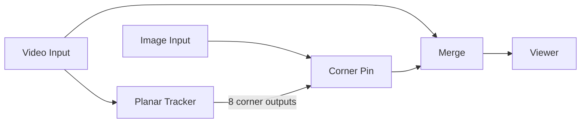

# 3 — Planar tracking and match-move

Track four corners of a flat, textured surface (a screen, a poster, a wall) and
corner-pin an insert onto it so it sticks with perspective.

**You will build:** `Video Input → Planar Tracker` feeding a `Corner Pin` that
warps an `Image Input`, composited over the plate with `Merge`.



## Before you start

- `Video Input → Viewer`, file set to `samples/source.mp4`.
- Pick a frame where the whole surface is visible and well lit.

## Steps

### 1. Track the surface

1. Add a **Planar Tracker**.
2. Connect `Video Input.frame → Planar Tracker.frame`.
3. Select it. Four corner handles appear in the viewport.
4. Drag each corner onto a feature of the surface, in this order:
   top-left, top-right, bottom-right, bottom-left. Keep them inside the
   surface — the tracker matches a patch at each corner.
5. Set the corner patches:
   - `Pattern → Pattern Size` (default 6) — patch size per corner, percent of width.
   - `Pattern → Search Radius` (default 12) — max motion per frame.
6. Press **Track ►**. All four corners are solved together, sampling each
   source frame only once.

> Each corner is an independent point tracker, so the usual point-tracking rules
> apply: put each corner on clearly textured detail, not on a flat or blurry
> area.

### 2. Corner-pin the insert

1. Add an **Image Input** with the artwork/screen content you want to place.
2. Add a **Corner Pin**.
3. Connect `Image Input.frame → Corner Pin.frame`.
4. Connect the eight corners one-to-one:

```
Planar Tracker.top_left_x      → Corner Pin.in_top_left_x
Planar Tracker.top_left_y      → Corner Pin.in_top_left_y
Planar Tracker.top_right_x     → Corner Pin.in_top_right_x
Planar Tracker.top_right_y     → Corner Pin.in_top_right_y
Planar Tracker.bottom_right_x  → Corner Pin.in_bottom_right_x
Planar Tracker.bottom_right_y  → Corner Pin.in_bottom_right_y
Planar Tracker.bottom_left_x   → Corner Pin.in_bottom_left_x
Planar Tracker.bottom_left_y   → Corner Pin.in_bottom_left_y
```

Corner values are percentages of the frame (0–100), matching the Corner Pin's
own corner properties.

### 3. Composite

1. Add a **Merge**.
2. Connect `Video Input.frame → Merge.background`.
3. Connect `Corner Pin.frame → Merge.foreground`.
4. Connect `Merge.frame → Viewer.frame`.

Add a little `Merge → Opacity` if the insert should look integrated, or a
**Light Wrap** node after the Corner Pin for a soft ambient bleed around the edges.

## Match-moving the whole plate (stabilise)

To reference-stabilise instead of inserting:

1. Add a **Corner Pin** on the plate itself.
2. Wire the Planar Tracker corners into it.
3. Turn on `Border → Stabilize`, which inverts the corner motion so the
   tracked surface is pinned in place.

## Mixing the insert with the plate

Because each corner is a full tracker, you can also keyframe the corner
properties by hand after a track:

- Drag a corner in the viewport to add a manual correction at the current frame
  (undoable).
- **Clear** removes only the tracked motion; the seed corners stay.

## Troubleshooting

| Symptom | Fix |
|---|---|
| One corner drifts | Its patch is probably on low-contrast detail. Move it and re-track, or lower that corner's expectations by raising `Pattern Size` |
| Surface "breathes" | The corners are too close together. Spread them to the widest usable points on the surface |
| Perspective flips on a fast pan | Raise `Pattern → Search Radius` |
| Insert is in the right place but the wrong size | The Image Input is fitted before pinning; set `Placement → Fit` and `Scale` on the Image Input first |
| "no frames could be matched" | At least one corner patch has no texture. Move corners onto detailed areas |

## Related

- [Point tracking](01-point-tracking.md) — single-point version and the recovery settings.
- [Depth maps and effects](04-depth-maps-and-effects.md) — parallax when there is no flat surface to track.
