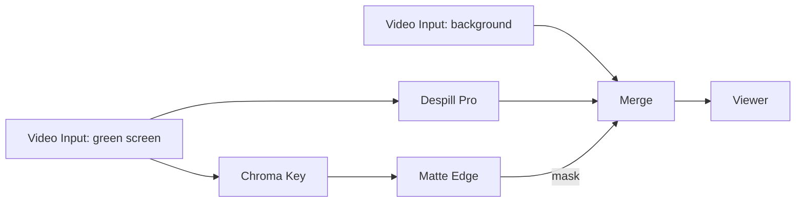

# 6 — Keying and compositing

Pull a chroma key, refine the matte, kill spill, and composite a new background.

**You will build:** footage → `Chroma Key` → `Matte Edge` → `Merge`, with
`Despill Pro` cleaning the foreground.

## Before you start

Have a green-screen clip and a background clip. The `examples/keying/` folder
contains `original.mp4`, `background.mp4`, and `result.mp4` for reference.

## Steps

1. Add two **Video Input** nodes: one for the green-screen plate, one for the
   background. Rename them (select and press `F2`) so the graph stays readable.
2. Add a **Chroma Key** and connect the green-screen plate into its `frame`.
3. Select the key colour:
   - `Key → Key Color` defaults to `(0, 177, 64)` (chroma green). Click the
     swatch and pick a pixel from the brightest, most even part of the screen.
   - `Key → Tolerance` = 10 — how far from the key colour still counts as
     background.
   - `Key → Softness` = 20 — the edge transition width.
4. Add a **Matte Edge** and connect `Chroma Key.mask → Matte Edge.mask`.
   - `Edge → Choke` — negative shrinks the matte, positive grows it. Start at 0.
   - `Edge → Feather` — 0–40; a value of 1–3 cleans hard video edges.
   - `Levels → Black Point` = 0, `White Point` = 100 — raise Black Point to
     crush translucent screen noise.
5. Add a **Despill Pro** on the plate (`key_color` matching the key) to remove
   green in the hair/edges. `Despill → Strength` = 100, `Processing → Mix` = 100.
6. Add a **Merge**:
   - `background` = the background clip.
   - `foreground` = `Despill Pro.frame`.
   - `mask` = `Matte Edge.mask`.
7. Connect `Merge.frame → Viewer.frame`.

## Refining the key

| Problem | Node / control |
|---|---|
| Screen is uneven (bright here, dark there) | Lower `Tolerance`, then use **Combine Masks** to union two Chroma Keys with different key colours |
| Detail lost in semi-transparent areas | Raise `Softness`, then lower `Levels → Black Point` on Matte Edge |
| Matte has holes | Add a **Roto**/`Shape Tracker` mask and combine with **Matte Combine Pro** (`Combine → Mode`) |
| Green fringe | Raise `Despill → Strength`, or add **Spill Suppress** after Despill Pro |
| Foreground looks pasted on | Add **Light Wrap** (`Wrap → Amount`, `Wrap → Blur`) after the merge |

## Combining mattes

`Matte Combine Pro` takes two `Mask` inputs (`a`, `b`) and a `Combine → Mode`
(add, subtract, intersect, and so on). This is the tool for "key object + roto
garbage matte". `Combine Masks` is the lighter-weight equivalent for simple
unions.

## Channel-based keys

For non-green keys (a bright sky, a flat backdrop), **Channel Mask** is often
better than Chroma Key:

1. `Channel Mask` on the plate, `Key → Channel` = the channel with the most
   separation (often Blue for skies).
2. `Key → Low` / `Key → High` isolate the range, `Key → Invert` flips it.
3. Refine with `Matte Edge` exactly as above.

## Troubleshooting

| Symptom | Fix |
|---|---|
| Whole image is keyed out | Key colour is wrong, or `Tolerance` is too high. Re-pick the key colour |
| Grey/translucent edges | Raise `Matte Edge → Levels → Black Point`, lower `Softness` |
| Background shows through the subject | Matte has holes: add a roto mask and union it with `Matte Combine Pro` |
| Foreground darker than the background | The keyed footage may be premultiplied differently. Try a **Premult** or adjust `Merge → Opacity` |

## Related

- [Roto and masks](07-roto-and-masks.md) — garbage mattes and manual shapes.
- [Shape Tracker masks](02-shape-tracker-masks.md) — a tracked matte for moving objects.
