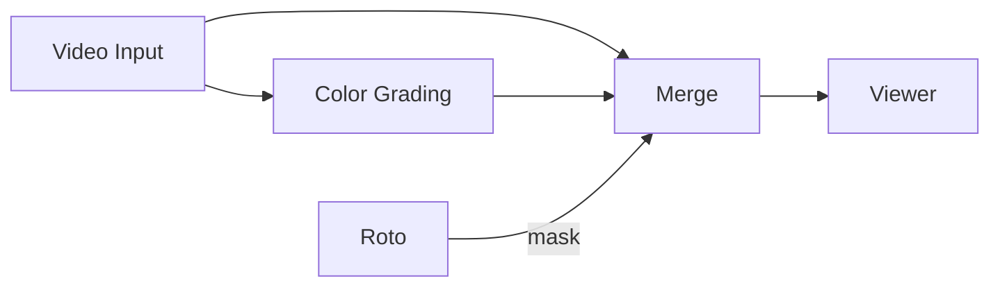

# 7 — Roto and masks

Draw keyframed shape masks for garbage mattes and rotoscoping, then combine
them with tracked or keyed mattes.

**You will build:** a `Roto` node whose `mask` output reveals a graded version
of the plate.

## Steps

1. Add a **Roto** node (`Tab` → `Roto`). It has no frame input — a Roto shape
   is a generated matte.
2. Turn on `Roto → Edit Mode`. The viewport overlay becomes editable and the
   Properties panel shows the shape controls.
3. Draw your shape in the viewport (click to add points, drag points to move,
   drag a segment to add a point).
4. Scrub to a later frame and move the points to match the subject — the shape
   is keyframed automatically as you edit. Move the playhead before every edit
   so each pose lands on the right frame.
5. Turn off `Roto → Edit Mode` to lock the shape and go back to navigating.

`Roto → Invert` swaps inside for outside (useful for garbage mattes that should
exclude a region rather than include it).

## Using the matte

A `Roto` outputs a single `mask` socket:

- `background` = the ungraded plate, `foreground` = the graded plate,
  `mask` = the Roto. The grade appears only inside the shape.
- Or invert it and use the shape as a **garbage matte** to exclude a rig,
  boom, or tracking marker before a key.

## Combining with other mattes

Use **Matte Combine Pro** to merge a Roto with a Chroma Key or Shape Tracker
mask:

1. `Chroma Key.mask → Matte Combine Pro.a`
2. `Roto.mask → Matte Combine Pro.b`
3. `Combine → Mode` = Union (add), Subtract, or Intersect as needed.
4. Feed the combined mask into a `Merge`.

`Combine Masks` does the same job with a simpler mode list.

## Related

- [Shape Tracker masks](02-shape-tracker-masks.md) — a matte that follows a tracked point.
- [Keying and compositing](06-keying-and-compositing.md) — where masks meet keys.
- [Roto rasterization reference](../user-guide.md).
