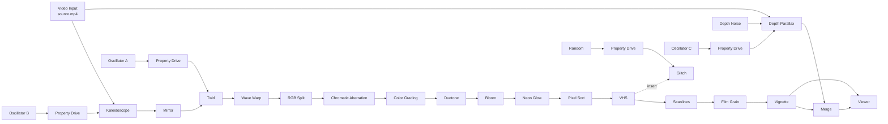

# 9 — Psychedelic VFX (advanced)

The flagship tutorial. Starting from the sample clip, you will build a
full-frame, animated, colour-cycling psychedelic treatment: mirrored symmetry,
layered warps, duotone + neon light, analog damage, a depth-driven parallax
layer, and four procedural drivers so nothing repeats mechanically.

**Source clip:** `aphelion-editor/samples/source.mp4`
**Time:** about 20–30 minutes.
**Difficulty:** advanced — it uses Property Drive, depth generators, and a
fan-out branch.

## What you are building

Two things make this "advanced":

1. **A fan-out branch** — the source feeds both the main colour chain and a
   separate depth-parallax branch; the two are merged at the end.
2. **Four procedural drivers** — Oscillator and Random nodes override node
   properties with no keyframes, so the animation never loops on a fixed beat.

---

## Step 1 — Project and source (2 min)

1. Start a new project. Set the project **fps** and dimensions to match the clip
   (the Video Input's `Project → Sync Timeline` will adopt the media's duration
   and frame rate when it loads).
2. Add a **Video Input** and a **Viewer**. Rename them `PLATE` and `VIEW`
   (select the node, press `F2`).
3. Select the Video Input and set **Source → File** to `samples/source.mp4`.
   Leave `Quality → Use Proxy` on and `Quality → Decode Width Cap` at 0.
4. Connect `PLATE.frame → VIEW.frame` and confirm the clip plays.

**Performance note:** this chain is heavy. In `VIEW → Performance → Proxy
Width`, keep the proxy at **960** while you work; raise it only for the final
check. The performance overlay (`Preferences → Performance → Show performance
overlay`) shows whether you are inside the frame budget.

---

## Step 2 — Symmetry core (3 min)

Insert nodes by pressing `Tab`, searching the name, and pressing Enter — the new
node is inserted into the selected connection.

1. Add **Kaleidoscope** between `PLATE` and `VIEW`.
   - `Pattern → Segments` = **8**
   - `Pattern → Rotation` = **12**
   - `Center → Center X/Y` = 50 / 50
2. Add **Mirror** after it.
   - `Mirror → Axis` = **Vertical**
   - `Mirror → Split` = 50
3. Add **Twirl** after that.
   - `Twist → Angle` = **45**
   - `Region → Radius` = **55**
   - `Twist → Strength` = 100
4. Add **Wave Warp** last in this group.
   - `Wave → Amplitude` = **30**, `Wave → Frequency` = **8**
   - `Wave → Direction` = 0

You now have a mirrored, twisted, rippling field. If it is too disorienting,
lower `Wave → Amplitude` — colour and light come next.

> **Tip:** every one of these nodes has `Processing → Mix` (100). Lowering it
> blends the effect with its input, which is the fastest way to taste-test a
> parameter without committing.

---

## Step 3 — Colour and light (4 min)

1. Add **RGB Split**.
   - `Channels → Red X` = **8**, `Channels → Blue X` = **-8**
2. Add **Chromatic Aberration**.
   - `Aberration → Amount` = **40**, `Aberration → Radial` = **20**
3. Add **Color Grading**.
   - `Primary → Exposure` = **10**
   - `Primary → Contrast` = **120**
   - `Primary → Saturation` = **170**
4. Add **Duotone**.
   - `Colors → Shadows` = **#120A30** (deep indigo)
   - `Colors → Highlights` = **#FFD478** (warm gold)
   - `Processing → Mix` = **60** — keep some original colour
5. Add **Bloom**.
   - `Glow → Threshold` = **70**, `Glow → Intensity` = **40**
   - `Blur → Radius` = **12**, `Glow → Tint` = white
6. Add **Neon Glow**.
   - `Neon → Color` = **#40FFDC** (cyan)
   - `Neon → Edge Threshold` = **60**
   - `Neon → Glow Radius` = **6**, `Neon → Intensity` = **200**
   - `Neon → Background` = **30**

The image should now glow with cyan edges over a gold/indigo duotone base.
Tune `Duotone → Mix` and `Neon Glow → Background` to taste.

---

## Step 4 — Analog damage (4 min)

Add these in order. Use `Processing → Mix` to dial each one back — they stack
fast.

1. **Pixel Sort**
   - `Sort → Sort Key` = choose Interactive/Brightness so the streaks read
   - `Sort → Threshold` = **55**
   - `Sort → Max Length` = **64**
   - `Sort → Reverse` = off
2. **VHS**
   - `VHS → Bleed` = **20**, `VHS → Noise` = **10**
3. **Scanlines**
   - `Lines → Intensity` = **35**, `Lines → Spacing` = **3**
   - `Lines → Line Width` = 1
   - `Motion → Flicker` = **5** (raise for a buzzing CRT)
4. **Film Grain**
   - `Grain → Amount` = **25**, `Grain → Grain Size` = **100**
   - `Grain → Monochrome` = off (coloured grain suits the palette)
5. **Vignette**
   - `Filter → Strength` = **55**, `Filter → Softness` = **60**

---

## Step 5 — Depth-driven parallax layer (5 min)

This is the fan-out branch. It gives the frame a second, independently moving
world that dissolves through the main one.

1. Add a **Depth Noise**. `Noise → Scale` = **32**, `Noise → Seed` = **0**.
2. Add a **Depth Parallax**.
3. Connect `Depth Noise.depth → Depth Parallax.depth`.
4. Connect `PLATE.frame → Depth Parallax.frame` (the source now feeds two
   branches — that is intentional).
5. Add a **Merge** before the Viewer:
   - `background` = `Vignette.frame` (the end of the main chain)
   - `foreground` = `Depth Parallax.frame`
   - `Merge → Blend Mode` = Screen or Overlay (experiment)
   - `Merge → Opacity` = **40**
6. Connect `Merge.frame → VIEW.frame`.

Scrub the timeline and watch the parallax layer shear against the base.

> **Why this works:** `Depth Parallax` offsets each pixel by its depth value, so
> a noise field becomes an organic, non-uniform smear. It is the closest thing
> to a feedback loop that an acyclic graph can do — and it is cheap.

---

## Step 6 — Glitch bursts (3 min)

1. Add a **Glitch** node between `VHS` and `Scanlines`
   (connect `VHS.frame → Glitch.frame`, `Glitch.frame → Scanlines.frame`).
   - `Glitch → Block Size` = **24**
   - `Glitch → Seed` = 0
   - `Glitch → Amount` = 0 for now — it will be driven below.
2. Add a **Random** node:
   - `Random → Per Frame` = **on**
   - `Random → Interval` = **2**
   - `Random → Min` = 0, `Random → Max` = **70**
   - `Random → Seed` = pick any value
3. Add a **Property Drive**.
   - Drag `Glitch.frame` into `Property Drive.target`.
   - `Drive → Property` = **Glitch · Amount**.
   - Connect `Random.value → Property Drive.value`.

The glitch now fires in irregular bursts the eye cannot predict. To make the
bursts stutter rather than ramp smoothly, keep `Interval` low (1–3).

> Add a **Range Check** between `Random` and `Property Drive` (`Range → Min` =
> 0.7, `Range → Max` = 1) to gate the glitch into occasional "hits" instead of
> continuous variation.

---

## Step 7 — Procedural motion (4 min)

Now make the warps breathe. Repeat this pattern for each driver:

**Pattern:** add a driver → add a **Property Drive** → drag the target node's
output socket into the Drive's `target` input → pick the property in
`Drive → Property` → connect the driver's `value` output to the Drive's `value`
input.

| Driver | Driver settings | Target node | Driven property |
|---|---|---|---|
| Oscillator A | Sine, `Frequency` 0.25, `Amplitude` 30, `Offset` 0 | Twirl | `Twist · Angle` |
| Oscillator B | Sine, `Frequency` 0.13, `Amplitude` 15, `Offset` 0 | Kaleidoscope | `Pattern · Rotation` |
| Oscillator C | Triangle, `Frequency` 0.4, `Amplitude` 40, `Offset` 50 | Depth Parallax | `Parallax · Shift X` |
| Oscillator D | Sine, `Frequency` 0.07, `Amplitude` 25, `Offset` 60 | Duotone | `Processing · Mix` |

Because the frequencies are not integer multiples of each other, the composite
motion takes a long time to repeat — this is what separates a procedural look
from a looping one.

**Variations to try:**

- Point Oscillator D at `Chromatic Aberration → Aberration · Amount` instead and
  watch the split pulse with the beat.
- Add a second `Property Drive` on `Neon Glow → Neon · Intensity` driven by an
  Oscillator at 2 Hz for a strobing edge light.
- Drive `Pixel Sort → Sort · Threshold` with `Timeline Normalized` to sweep the
  streaks across the shot in one direction.

---

## Step 8 — Final grade and export (2 min)

1. Add one more **Color Grading** at the very end of the main chain (after
   Vignette, before the Merge) for a final look pass:
   - `Balance → Temperature` = 10 (warmer)
   - `Primary → Contrast` = 110, `Primary → Saturation` = 120
2. Check the whole shot at full quality: set `VIEW → Performance → Proxy Width`
   back to 1920 and scrub. If playback drops frames, see the tips below.
3. Export: **File → Export…**, choose a format and destination. Export reads the
   **active Viewer**, so select `VIEW` (click it and use the graph or the
   `Active viewer` status message) before exporting. Enable audio in the export
   options if you want the clip's sound.

---

## Complete parameter reference

| Node | Property | Value |
|---|---|---|
| Kaleidoscope | `Pattern → Segments` / `Rotation` | 8 / driven (was 12) |
| Mirror | `Mirror → Axis` / `Split` | Vertical / 50 |
| Twirl | `Twist → Angle` / `Region → Radius` / `Twist → Strength` | driven / 55 / 100 |
| Wave Warp | `Wave → Amplitude` / `Frequency` / `Direction` | 30 / 8 / 0 |
| RGB Split | `Channels → Red X` / `Blue X` | 8 / -8 |
| Chromatic Aberration | `Aberration → Amount` / `Radial` | 40 / 20 |
| Color Grading | `Primary → Exposure` / `Contrast` / `Saturation` | 10 / 120 / 170 |
| Duotone | `Colors → Shadows` / `Highlights` / `Mix` | #120A30 / #FFD478 / driven |
| Bloom | `Glow → Threshold` / `Intensity`, `Blur → Radius` | 70 / 40 / 12 |
| Neon Glow | `Neon → Color` / `Edge Threshold` / `Intensity` | #40FFDC / 60 / 200 |
| Pixel Sort | `Sort → Threshold` / `Max Length` | 55 / 64 |
| Glitch | `Glitch → Amount` / `Block Size` | driven / 24 |
| VHS | `VHS → Bleed` / `Noise` | 20 / 10 |
| Scanlines | `Lines → Intensity` / `Spacing`, `Motion → Flicker` | 35 / 3 / 5 |
| Film Grain | `Grain → Amount` / `Grain Size` | 25 / 100 |
| Vignette | `Filter → Strength` / `Softness` | 55 / 60 |
| Depth Noise | `Noise → Scale` / `Seed` | 32 / 0 |
| Depth Parallax | `Parallax → Shift X` / `Shift Y` | driven / 0 |
| Merge | `Merge → Blend Mode` / `Opacity` | Screen / 40 |

## Keeping it real-time

| Problem | Fix |
|---|---|
| Playback drops frames | Lower `VIEW → Performance → Proxy Width` (960 or 640), or set `Preferences → Performance → Drop frames` to Adaptive |
| Pixel Sort is the bottleneck | `Sort → Max Length` is the cost driver — lower it |
| Bloom/Neon Glow is slow | Lower `Blur → Radius` / `Neon → Glow Radius` |
| Merge is expensive at full size | Merge at proxy size and only raise the proxy for stills or export |
| The whole graph is heavy | Add `Processing → Mix` reductions first; disable nodes you are not using rather than deleting them |
| You want to save the look | Select the whole chain and use **Create Custom Node…** (`Ctrl+Shift+G`) to fold it into a reusable chip with exposed parameters |

## Troubleshooting

| Symptom | Fix |
|---|---|
| Depth Parallax has no effect | `Depth Noise → Scale` too high — the field is uniform. Lower it, or raise `Parallax → Shift X` |
| Merge makes everything grey | `Merge → Opacity` too high with Screen blending. Lower it to 25–40 |
| Drivers do nothing | The Property Drive's `target` input is not connected. Drag the **target node's output socket** into it, then re-pick the property |
| Oscillator motion is out of range | Insert a **Clamp** between the Oscillator and the Drive, or lower `Wave → Amplitude` |
| The look resets every few seconds | Two Oscillators share a frequency. Give them unrelated frequencies (for example 0.07, 0.13, 0.25, 0.4) |

## Next steps

- Feed the finished chain into **Image Input → Corner Pin** and match-move a logo over it with the [Planar Tracker](03-planar-tracking-match-move.md).
- Rebuild the "analog damage" group as a custom node so you can re-use it.
- Replace `Depth Noise` with a `Depth Gradient` + tracked matte for scene-specific parallax — see [Depth maps and effects](04-depth-maps-and-effects.md).
